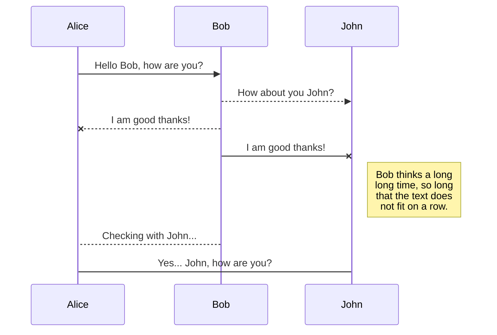
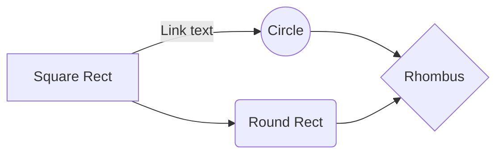

# APEX 및 ORDS 설치 가이드

해당 문서는 ON-PREMISE 환경에서 APEX 설치 과정을 설명합니다. WEB SERVER를 위한 TOMCAT 세팅이 완료되었다는 가정하에 문서가 작성되었습니다.

## 버전 정보
- ORACLE DATABASE : 11GR2
- ORACLE APEX : 18.2
- TOMCAT : 8.5.37
- ORDS (ORACLE RESTFUL DATA SERVICE) : 18.4.0

## 설명
 APEX는 ORACLE DATABASE 안에 내장되어 있는 WEB DEVELOPMENT를 위한 PLATFORM 입니다. ORACLE DB를 설치하면 기본적으로 내장되어 있으나 버전이 최신이 아닐 수 있으므로 OTN(ORACLE TECHNOLOGY NETWORK)에 등재되어 있는 [최신 APEX를 다운로드](https://www.oracle.com/technetwork/developer-tools/apex/downloads/index.html) 받아서 사용하는 것을 권장합니다. 
 
 APEX 설치는 크게 두가지의 단계로 이루어져 있습니다.
 1.  **APEX 설치**. APEX는 다수의 SCHEMA, PL/SQL PACKAGE 로 이루어져 있으며 DATABASE 서버내에 설치됩니다. 
 
 2.  APEX의 WEB LISTENER 역할을 담당하는 **ORDS 설치**. ORDS는 4가지 모드로 설치 가능합니다.
 -- STANDALONE 모드 : APEX가 설치된 DB 서버에 ORDS 설치
 -- ORACLE WEBLOGIC SERVER에 설치
 -- GLASSFISH SERVER에 설치
 -- **APACHE TOMCAT에 설치**
이 문서는 APACHE TOMCAT에 설치하는 것을 설명합니다.
     >NOTE :  
     APEX, ORDS 버전 별 지원되는 플랫폼이 상이할 수 있으므로 APEX버전, ORDS 버전, TOMCAT 버전을 필히 확인 후 설치하시기 바랍니다.
[설치 전 버전 확인](https://docs.oracle.com/en/database/oracle/oracle-rest-data-services/18.3/aelig/installing-REST-data-services.html#GUID-57B22E09-081E-4326-A9D5-61635B518931)

## APEX 설치 [DB 서버에서 작업]
> Note:
>설치 전 시스템 요구사항을 확인 후 설치합니다. [링크로 이동](https://docs.oracle.com/en/database/oracle/application-express/18.2/htmig/Oracle-AE-installation-requirements.html#GUID-02BE4A34-B631-412C-8A82-EB92DABBACE0)
### APEX tablespace 생성
APEX에서 사용하는 SCHEMA, TABLE들의 관리 편이성를 위하여 별도의 tablespace를 두고 사용하는 것이 좋습니다.

	-- For OMF
	CREATE TABLESPACE apex2 DATAFILE SIZE 100M AUTOEXTEND ON NEXT 1M; 
	-- For non-OMF
	CREATE TABLESPACE apex DATAFILE '/path/to/datafiles/apex01.dbf' SIZE 100M AUTOEXTEND ON NEXT 1M;

### APEX 다운로드 및 설치

1. [최신 APEX를 다운로드](https://www.oracle.com/technetwork/developer-tools/apex/downloads/index.html) 받고 압축파일을 푼 후 압축파일 푼 폴더의 경로로 이동합니다.
2. SQL *Plus 에서 DATABASE에 접속. APEX는 SYSDBA role을 가진 SYS 유저로 진행합니다.

		$ sqlplus /nolog
		SQL> CONNECT SYS as SYSDBA
		Enter password: SYS_password
  
	    SQL> @apexins.sql APEX APEX TEMP /i/ -- Full development 환경을 설치
    - 설치 패키지 뒤의 parameter는 각각 순서대로 APEX APPLICATION USER tablespace, APEX FILE USER tablespace, APEX 가상 이미지 디렉토리 이름을 의미합니다.

3. APEX 설치가 완료되면 APEX_180200, FLOWS_FILES, APEX_PUBLIC_USER 가 생성됩니다

		SQL> select username, created, account_status, lock_date from dba_users where created > trunc(sysdate) order by 2; --생성한 USER 확인
		
### APEX instance admin account 생성
APEX 개발 환경을 총 관리하는 APEX ADMIN ACCOUNT를 생성합니다. ADMIN 유저는 APEX 설치 후 최초 접속 시에도 사용합니다.

	SQL> @apxchpwd.sql --추후에 ADMIN 패스워드를 잊어버렸을 때에도 이 스크립트를 돌려 PASSWORD RESET할 수 있음.

### APEX_PUBLIC_USER 설정
APEX_PUBLIC_USER는 최초 생성 시 RANDOM PASSWORD로 설정되어 있습니다. 초기 비밀번호 세팅을 수행합니다.

	SQL> ALTER PROFILE DEFAULT limit PASSWORD_LIFE_TIME UNLIMITED ;

ORACLE DATABASE 11G 이상 버전 부터는 DEFAULT USER PROFILE에 PASSWORD LIFE TIME이 180일로 설정되어 있습니다. 이 제한으로 인해 ORDS에서 APEX로 CONNECTION 시 PASSWORD가 LOCK-IN되어 문제가 발생할 수 있으므로 해당 유저의 PASSWORD 설정을 변경합니다.

	SQL> ALTER PROFILE DEFAULT limit PASSWORD_LIFE_TIME UNLIMITED;
	

## ORDS 설치 [Tomcat 서버에서 작업]
>Note:
>이 문서는 ORDS 구성에 필요한 Tomcat 및 JAVA가 이미 설치되어 있다는 가정하에 작성되었습니다. Tomcat 및 JAVA 설치 및 환경 세팅관련은 다른 문서를 참조하세요.

### 설치 환경
- OS : OEL(Oracle Enterprise Linux) 6.9
- JDK 8 이상
- Apache Tomcat 8.5 이상
### 사전 점검 사항
TOMCAT 서버와 DATABASE 서버와의 통신을 위해 DB 서버 LISTENER 포트를 열어 줍니다. 

### ORDS 다운로드
[다운로드 링크](https://www.oracle.com/technetwork/developer-tools/rest-data-services/downloads/index.html) 에서 최신 ORDS를 다운로드 받습니다.

	$ mkdir ords 
	$ unzip ords-18.4.0.354.1002.zip -d ords	

### ORDS 설치
압축을 푼 경로로 들어갑니다.

	$ cd ords 
	$ ls -al
	drwxr-xr-x. 7 root root     4096 Jan 18 07:51 .
	drwxr-xr-x. 3 root root     4096 Jan 18 07:06 ..
	drwxr-xr-x. 2 root root     4096 Jan 18 07:51 conf
	drwxr-xr-x. 3 root root     4096 Jan 11 10:15 docs
	drwxr-xr-x. 6 root root     4096 Oct 15 17:29 examples
	-rw-r--r--. 1 root root    31362 Dec 14 15:32 index.html
	drwxr-xr-x. 3 root root     4096 Jan 18 07:40 ords
	-rw-r--r--. 1 root root 59033835 Jan 18 07:40 ords.war
	drwxr-xr-x. 2 root root     4096 Jan 18 08:25 params

다음의 명령어로 ORDS를 설치합니다. 아래 예시를 참고하여서 설치를 진행합니다. 

	$ java -jar ords.war install advanced
	Enter the name of the database server [DB host name]: <Database Server IP>
	Enter the database listen port [1521]: 1521
	Enter 1 to specify the database service name, or 2 to specify the database SID [1]:1
	Enter the database service name: <database service name>
	Enter 1 if you want to verify/install Oracle REST Data Services schema or 2 to skip this step [1]:1
	
	--- 위의 정보로 database에 jdbc connection을 맺고 ORDS_PUBLIC_USER를 생성함 --
	
	Enter the database password for ORDS_PUBLIC_USER:
	Confirm password:           
	Requires SYS AS SYSDBA to verify Oracle REST Data Services schema.

	Enter the database password for SYS AS SYSDBA:
	Confirm password:

	Retrieving information.
	Enter the default tablespace for ORDS_METADATA [SYSAUX]: APEX
	Enter the temporary tablespace for ORDS_METADATA [TEMP]: TEMP
	Enter the default tablespace for ORDS_PUBLIC_USER [USERS]: APEX
	Enter the temporary tablespace for ORDS_PUBLIC_USER [TEMP]: TEMP
	Enter 1 if you want to use PL/SQL Gateway or 2 to skip this step.
	If using Oracle Application Express or migrating from mod_plsql then you must 	enter 1 [1]: 1
	Enter the PL/SQL Gateway database user name [APEX_PUBLIC_USER]: APEX_PUBLIC_USER
	Enter the database password for APEX_PUBLIC_USER:
	Confirm password:
	Enter 1 to specify passwords for Application Express RESTful Services database users (APEX_LISTENER, APEX_REST_PUBLIC_USER) or 2 to skip this step [1]:1
	Enter the database password for APEX_LISTENER:
	Confirm password:
	Enter the database password for APEX_REST_PUBLIC_USER:
	Confirm password:
	Jan 18, 2019 8:59:00 AM
	INFO: reloaded pools: []
	Installing Oracle REST Data Services version 18.4.0.r3541002
	... Log file written to /root/ords_install_core_2019-01-18_085900_00587.log
	... Verified database prerequisites
	... Created Oracle REST Data Services schema
	... Created Oracle REST Data Services proxy user
	... Granted privileges to Oracle REST Data Services
	... Created Oracle REST Data Services database objects
	... Log file written to /root/ords_install_datamodel_2019-01-18_085910_00552.log
	... Log file written to /root/ords_install_apex_2019-01-18_085911_00486.log
	Completed installation for Oracle REST Data Services version 18.4.0.r3541002. Elapsed time: 00:00:11.757

	Enter 1 if you wish to start in standalone mode or 2 to exit [1]:2

# Synchronization

Synchronization is one of the biggest features of StackEdit. It enables you to synchronize any file in your workspace with other files stored in your **Google Drive**, your **Dropbox** and your **GitHub** accounts. This allows you to keep writing on other devices, collaborate with people you share the file with, integrate easily into your workflow... The synchronization mechanism takes place every minute in the background, downloading, merging, and uploading file modifications.

There are two types of synchronization and they can complement each other:

- The workspace synchronization will sync all your files, folders and settings automatically. This will allow you to fetch your workspace on any other device.
	> To start syncing your workspace, just sign in with Google in the menu.

- The file synchronization will keep one file of the workspace synced with one or multiple files in **Google Drive**, **Dropbox** or **GitHub**.
	> Before starting to sync files, you must link an account in the **Synchronize** sub-menu.

## Open a file

You can open a file from **Google Drive**, **Dropbox** or **GitHub** by opening the **Synchronize** sub-menu and clicking **Open from**. Once opened in the workspace, any modification in the file will be automatically synced.

## Save a file

You can save any file of the workspace to **Google Drive**, **Dropbox** or **GitHub** by opening the **Synchronize** sub-menu and clicking **Save on**. Even if a file in the workspace is already synced, you can save it to another location. StackEdit can sync one file with multiple locations and accounts.

## Synchronize a file

Once your file is linked to a synchronized location, StackEdit will periodically synchronize it by downloading/uploading any modification. A merge will be performed if necessary and conflicts will be resolved.

If you just have modified your file and you want to force syncing, click the **Synchronize now** button in the navigation bar.

> **Note:** The **Synchronize now** button is disabled if you have no file to synchronize.

## Manage file synchronization

Since one file can be synced with multiple locations, you can list and manage synchronized locations by clicking **File synchronization** in the **Synchronize** sub-menu. This allows you to list and remove synchronized locations that are linked to your file.

# Publication

Publishing in StackEdit makes it simple for you to publish online your files. Once you're happy with a file, you can publish it to different hosting platforms like **Blogger**, **Dropbox**, **Gist**, **GitHub**, **Google Drive**, **WordPress** and **Zendesk**. With [Handlebars templates](http://handlebarsjs.com/), you have full control over what you export.

> Before starting to publish, you must link an account in the **Publish** sub-menu.

## Publish a File

You can publish your file by opening the **Publish** sub-menu and by clicking **Publish to**. For some locations, you can choose between the following formats:

- Markdown: publish the Markdown text on a website that can interpret it (**GitHub** for instance),
- HTML: publish the file converted to HTML via a Handlebars template (on a blog for example).

## Update a publication

After publishing, StackEdit keeps your file linked to that publication which makes it easy for you to re-publish it. Once you have modified your file and you want to update your publication, click on the **Publish now** button in the navigation bar.

> **Note:** The **Publish now** button is disabled if your file has not been published yet.

## Manage file publication

Since one file can be published to multiple locations, you can list and manage publish locations by clicking **File publication** in the **Publish** sub-menu. This allows you to list and remove publication locations that are linked to your file.

# Markdown extensions

StackEdit extends the standard Markdown syntax by adding extra **Markdown extensions**, providing you with some nice features.

> **ProTip:** You can disable any **Markdown extension** in the **File properties** dialog.

## SmartyPants

SmartyPants converts ASCII punctuation characters into "smart" typographic punctuation HTML entities. For example:

|                |ASCII                          |HTML                         |
|----------------|-------------------------------|-----------------------------|
|Single backticks|`'Isn't this fun?'`            |'Isn't this fun?'            |
|Quotes          |`"Isn't this fun?"`            |"Isn't this fun?"            |
|Dashes          |`-- is en-dash, --- is em-dash`|-- is en-dash, --- is em-dash|

## KaTeX

You can render LaTeX mathematical expressions using [KaTeX](https://khan.github.io/KaTeX/):

The *Gamma function* satisfying $\Gamma(n) = (n-1)!\quad\forall n\in\mathbb N$ is via the Euler integral

$$
\Gamma(z) = \int_0^\infty t^{z-1}e^{-t}dt\,.
$$

> You can find more information about **LaTeX** mathematical expressions [here](http://meta.math.stackexchange.com/questions/5020/mathjax-basic-tutorial-and-quick-reference).

## UML diagrams

You can render UML diagrams using [Mermaid](https://mermaidjs.github.io/). For example, this will produce a sequence diagram:

And this will produce a flow chart:

<!--stackedit_data:
eyJoaXN0b3J5IjpbLTE3OTU4NTk5MjEsLTM3NjkxMjczMiwtMT
AwMjkzMzE2LDE5NDY1MzY4OTQsOTIxMTQ1MzQsMTMwNTE4NTcw
OCwtMTA2NDc0OTMwNSwtMTQ2NTExMTY2NSwxMDc0NzQ5Mzc1LD
EwOTk5OTI1NjBdfQ==
-->